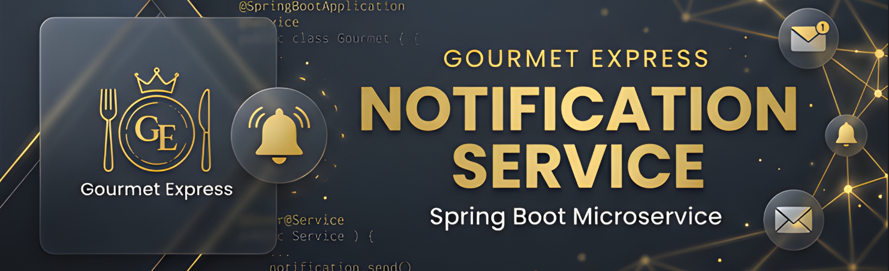
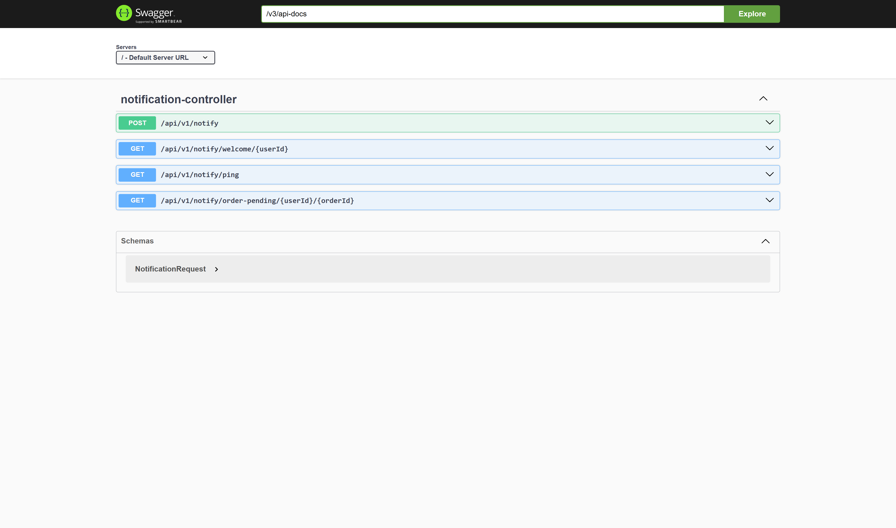
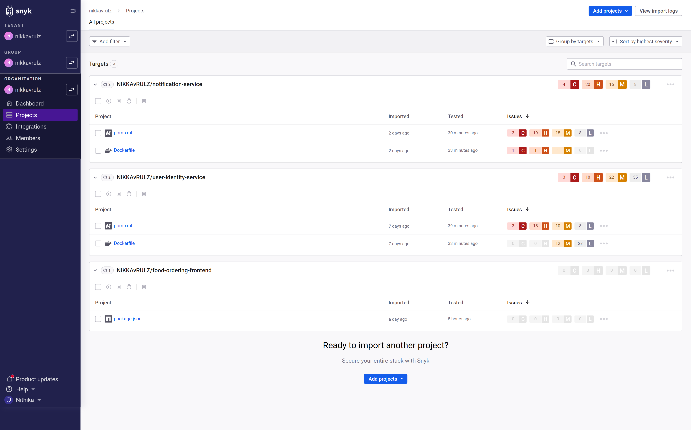
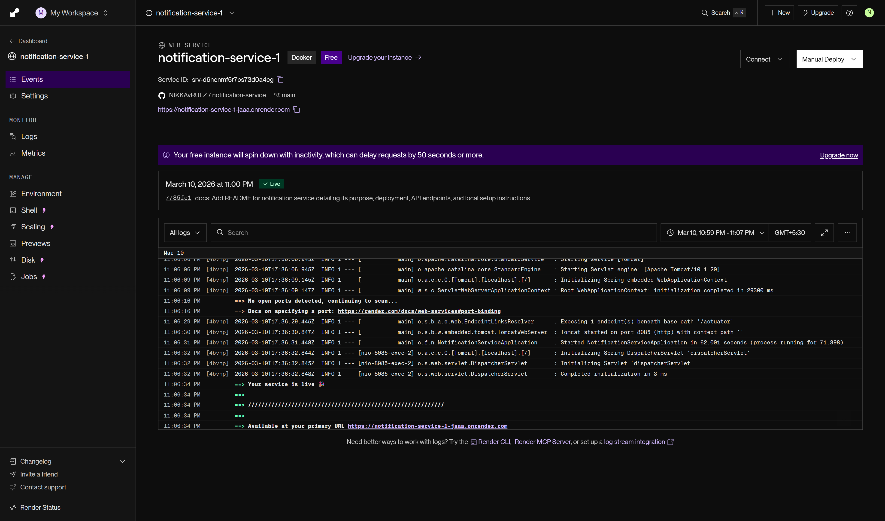

# Notification Service ✉️ | Gourmet Express



**Gourmet Express** is a luxury food delivery platform built with a distributed microservice architecture. This repository contains the **Notification Service**, a Spring Boot-based microservice responsible for sending email notifications across the platform.

---

## 🚀 Overview
The Notification Service coordinates asynchronous alerts for user registrations, order status updates, and payment summaries using JavaMailSender and SendGrid.

## 🌐 Live Deployment
* **Base URL:** `https://notification-service-production-e192.up.railway.app/api/v1/notify`
* **API Documentation (Swagger):** [Explore Endpoints](https://notification-service-production-e192.up.railway.app/swagger-ui.html)

---

## 📸 Project Screenshots

<details>
<summary><b>1. Working Prototype: Live Swagger UI</b> (Expand)</summary>
<br>
  
 
* This screenshot shows the live, interactive Swagger UI documentation for the User Identity Service. It allows you to test the registration, login, and user profile endpoints directly in your browser.
</details>

<details>
<summary><b>2. DevSecOps: Snyk Vulnerability Scan</b> (Expand)</summary>
<br>
  
 
* This screenshot from the Snyk dashboard confirms that the project's `pom.xml` and `Dockerfile` have been scanned. It shows **2 High Severity** findings that are documented for risk mitigation in the final project report.
</details>

<details>
<summary><b>3. Managed Orchestration: Render Deployment Status</b> (Expand)</summary>
<br>
  
 
* This screenshot confirms that the User Identity Service is **Live** and running on **Render's managed cloud environment**. It successfully binds to port **8080** and has completed the deployment pipeline.
</details>

---

## 🛠️ Tech Stack
* **Framework:** Spring Boot 3
* **Email Client:** JavaMailSender / SendGrid
* **Containerization:** Docker
* **API Documentation:** OpenAPI / Swagger
* **Cloud Hosting:** Railway

---

## 📦 API Endpoints
Detailed interactive documentation for the REST APIs can be found on our live Swagger UIs:

### ✉️ Notification Service (Live)
**Swagger UI:** [https://notification-service-production-e192.up.railway.app/swagger-ui.html](https://notification-service-production-e192.up.railway.app/swagger-ui.html)  
**Base URL:** `https://notification-service-production-e192.up.railway.app/api/v1/notify`

* `POST /` - Process payment notification and send integration email
* `GET /welcome/{userId}` - Send a welcome email to a newly registered user
* `GET /order-pending/{userId}/{orderId}` - Send an email reminder for an order with a pending payment status
* `GET /ping` - Health check endpoint to keep the service awake

---

## 🧪 Setup & Installation
1. **Clone the repository**:
   ```bash
   git clone https://github.com/your-username/notification-service.git
   ```
2. **Configure Environment Variables**:
   Update `application.yaml` or set environment variables with your `SENDGRID_API_KEY` and mail properties.
3. **Run Maven build**:
   ```bash
   mvn clean package
   ```
4. **Run the application**:
   ```bash
   java -jar target/*.jar
   ```
5. Access Swagger at: `http://localhost:8086/swagger-ui.html`

--- 
Developed with ❤️ by **NIKKA**
